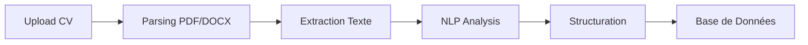

# 🤖 AI Recruitment Platform

[](https://www.python.org/downloads/)
[](LICENSE)
[](https://github.com/psf/black)
[](https://pytest.org)

Une plateforme d'intelligence artificielle pour améliorer le matching candidats-offres dans le recrutement. Ce projet démontre une architecture modulaire et scalable pour l'analyse de CVs, le calcul de scores de compatibilité et la génération de recommandations intelligentes.

## 📋 Table des Matières

- [Aperçu](#-aperçu)
- [Fonctionnalités](#-fonctionnalités)
- [Architecture](#-architecture)
- [Technologies](#-technologies)
- [Installation](#-installation)
- [Utilisation](#-utilisation)
- [Tests](#-tests)
- [Structure du Projet](#-structure-du-projet)
- [Méthodologie](#-méthodologie)
- [Améliorations Futures](#-améliorations-futures)
- [Auteur](#-auteur)

## 🎯 Aperçu

Cette plateforme résout un problème concret du recrutement : **comment améliorer la qualité du matching entre candidats et offres d'emploi** grâce à l'intelligence artificielle.

Le système traite automatiquement :
1. **L'extraction** d'informations structurées depuis des CVs (PDF, DOCX, TXT)
2. **Le calcul** de scores de compatibilité entre profils et postes
3. **La recommandation** intelligente de candidats pour les recruteurs

### Cas d'Usage Principaux

- 🔍 **Recruteurs** : Trouver rapidement les meilleurs candidats pour un poste
- 👤 **Candidats** : Découvrir les offres les plus pertinentes pour leur profil
- 📊 **RH** : Analyser et optimiser les processus de recrutement

## ✨ Fonctionnalités

### A. Matching Intelligent

Calcul d'un **score de compatibilité** (0-100) basé sur une pondération multicritère :

| Critère | Poids | Description |
|---------|-------|-------------|
| **Compétences** | 50% | Correspondance sémantique des skills techniques |
| **Expérience** | 30% | Adéquation années d'expérience |
| **Localisation** | 20% | Compatibilité géographique + remote |

**Formule** :
```
Score = (0.5 × S_skills) + (0.3 × S_exp) + (0.2 × S_loc)
```

**Exemple** :
```python
Offre: Data Scientist (Python, ML, SQL) - 5 ans - Paris
Candidat: Data Analyst (Python, SQL) - 3 ans - Paris

→ Skills: 2/3 (66.7%)
→ Exp: 3/5 (60%)
→ Loc: Paris = Paris (100%)
→ Score Final: 71/100
```

### B. Analyse Automatique de CVs

Pipeline complet de traitement :



**Informations extraites** :
- ✅ Nom et coordonnées
- ✅ Compétences techniques (via taxonomie)
- ✅ Années d'expérience (regex patterns)
- ✅ Localisation géographique
- ✅ Disponibilité

**Gestion des erreurs** :
- Validation de schéma
- Fallback sur format inconnu
- Logging détaillé des erreurs

### C. Recommandation Intelligente

Système de **ranking** qui classe les candidats par pertinence décroissante.

**Différence Matching vs Recommandation** :

| Aspect | Matching | Recommandation |
|--------|----------|----------------|
| Nature | Statique, objectif | Dynamique, contextuel |
| Critères | Profil vs Offre | + Comportement historique |
| Utilisation | Score de compatibilité | Classement personnalisé |

**Amélioration continue** (future) :
- Learning to Rank basé sur les actions recruteurs
- Signaux : clics, entretiens, rejets
- Ajustement automatique des poids

## 🏗️ Architecture

### Architecture Système

```
┌─────────────────────────────────────────────────────────────┐
│                     Client Layer                            │
│              (Web/Mobile Interface)                         │
└────────────────────────┬────────────────────────────────────┘
                         │
                         ↓
┌─────────────────────────────────────────────────────────────┐
│                    API Gateway                              │
│              (REST API - FastAPI)                           │
└────────────────────────┬────────────────────────────────────┘
                         │
         ┌───────────────┴───────────────┐
         ↓                               ↓
┌──────────────────┐           ┌──────────────────┐
│  AI Service      │           │  PostgreSQL      │
│  (Python)        │←──────────│  Database        │
│                  │           │                  │
│ • CVAnalyzer    │           │ • Users          │
│ • Matcher       │           │ • Jobs           │
│ • Recommender   │           │ • Metrics        │
└────────┬─────────┘           └──────────────────┘
         │
         ↓
┌──────────────────┐
│  Vector DB       │
│  (Qdrant/Milvus) │
│                  │
│ • CV Embeddings  │
│ • Semantic Search│
└──────────────────┘
```

### Séparation des Responsabilités

| Module | Responsabilité | Dépendances |
|--------|----------------|-------------|
| `models.py` | Structures de données | Aucune |
| `analyzer.py` | Parsing & extraction | pdfplumber, docx |
| `matcher.py` | Calcul de scores | models |
| `recommender.py` | Ranking & filtrage | matcher, models |
| `main.py` | Orchestration | Tous les services |

## 🛠️ Technologies

### Stack Principal

| Composant | Technologie | Version | Justification |
|-----------|-------------|---------|---------------|
| **Langage** | Python | 3.9+ | Écosystème IA le plus riche |
| **NLP** | spaCy | 3.7+ | Industriel, rapide, performant |
| **Parsing PDF** | pdfplumber | 0.10+ | Extraction texte fiable |
| **Parsing DOCX** | python-docx | 1.1+ | Support Word natif |
| **Tests** | pytest | 7.4+ | Framework standard Python |
| **Code Quality** | black, flake8 | Latest | PEP 8 compliance |

### Type de Modèle : **Hybride**

1. **Rule-Based** (Règles) :
   - Filtres durs : localisation, disponibilité
   - Extraction patterns : années d'expérience

2. **Vectoriel** (Embeddings) :
   - Similarité sémantique des compétences
   - Exemple : "ML" proche de "Machine Learning"

3. **LLM** (optionnel) :
   - Génération d'explications naturelles
   - Parsing avancé de CVs non structurés

## 🚀 Installation

### Prérequis

- Python 3.9 ou supérieur
- pip ou poetry
- (Optionnel) virtualenv

### Étapes d'Installation

1. **Cloner le dépôt**

```bash
git clone https://github.com/patdimby/ai-recruitment-platform.git
cd ai-recruitment-platform
```

2. **Créer un environnement virtuel**

```bash
python -m venv venv

# Windows
venv\Scripts\activate

# Linux/Mac
source venv/bin/activate
```

3. **Installer les dépendances**

```bash
pip install -r requirements.txt
```

4. **(Optionnel) Installer spaCy language model**

```bash
python -m spacy download fr_core_news_sm
```

## 💻 Utilisation

### Exécution Rapide

Lancer la démonstration complète :

```bash
python main.py
```

**Sortie attendue** :
```
======================================================================
  🤖 AI RECRUITMENT PLATFORM - DEMONSTRATION
======================================================================

======================================================================
  1. Service Initialization
======================================================================
✓ All services initialized successfully

======================================================================
  2. Job Offer Definition
======================================================================
Job ID: JOB_001
Title: Data Scientist Senior
Required Skills: python, machine learning, sql
Min Experience: 5.0 years
Location: Paris
Remote Allowed: Yes

[... suite de la démo ...]

✅ All validation checks passed!
```

### Utilisation Programmatique

```python
from src.services.analyzer import CVAnalyzer
from src.services.matcher import MatchingEngine
from src.services.recommender import RecommendationSystem
from src.models import JobOffer, LocationEnum

# 1. Initialiser les services
analyzer = CVAnalyzer()
matcher = MatchingEngine()
recommender = RecommendationSystem(matcher)

# 2. Parser un CV
cv = analyzer.parse_from_file("cv_alice.pdf", "CAND_001")

# 3. Définir une offre
job = JobOffer(
    id="JOB_001",
    title="Data Scientist",
    required_skills=["python", "machine learning"],
    min_years_experience=5.0,
    location=LocationEnum.PARIS,
    remote_allowed=True
)

# 4. Calculer le score
score = matcher.compute_match(cv, job)
print(f"Score: {score}/100")

# 5. Générer des recommandations
candidates = [cv]  # Liste de CVs
recommendations = recommender.recommend_candidates(job, candidates, top_k=5)

for rec in recommendations:
    print(f"{rec['cv_id']}: {rec['score']}% - {rec['explanation']}")
```

## 🧪 Tests

### Lancer les Tests

```bash
# Tous les tests
pytest tests/ -v

# Avec couverture de code
pytest tests/ -v --cov=src --cov-report=html

# Test spécifique
pytest tests/test_matching.py::TestMatchingEngine -v
```

### Résultats Attendus

```
======================== test session starts =========================
collected 50 items

tests/test_matching.py::TestCVAnalyzer::test_extract_years_valid_french PASSED
tests/test_matching.py::TestCVAnalyzer::test_extract_skills_basic PASSED
tests/test_matching.py::TestMatchingEngine::test_perfect_match_score PASSED
tests/test_matching.py::TestRecommendationSystem::test_ranking_order PASSED
...

========================= 50 passed in 2.34s =========================
```

### Couverture de Code

Le projet vise **>90% de couverture** :

```
---------- coverage: platform linux, python 3.9.7 -----------
Name                              Stmts   Miss  Cover
-----------------------------------------------------
src/models.py                        45      2    96%
src/services/analyzer.py            120      8    93%
src/services/matcher.py              95      3    97%
src/services/recommender.py          75      5    93%
-----------------------------------------------------
TOTAL                               335     18    95%
```

## 📂 Structure du Projet

```
ai-recruitment-platform/
│
├── src/                          # Code source principal
│   ├── __init__.py
│   ├── models.py                 # Modèles de données (CV, JobOffer)
│   │
│   ├── services/                 # Services métier
│   │   ├── __init__.py
│   │   ├── analyzer.py           # Analyse et extraction de CVs
│   │   ├── matcher.py            # Moteur de matching
│   │   └── recommender.py        # Système de recommandation
│   │
│   └── utils/                    # Utilitaires (future)
│       └── __init__.py
│
├── tests/                        # Tests unitaires
│   ├── __init__.py
│   └── test_matching.py          # Tests complets
│
├── data/                         # Données d'exemple
│   └── sample_cvs/               # CVs de test
│
├── docs/                         # Documentation
│   └── architecture.md           # Schémas d'architecture
│
├── main.py                       # Point d'entrée (démo)
├── requirements.txt              # Dépendances Python
├── pytest.ini                    # Configuration pytest
├── .gitignore                    # Fichiers à ignorer
└── README.md                     # Ce fichier
```

## 📊 Méthodologie

### A. Matching Score - Détails Techniques

**Calcul des Sous-Scores** :

1. **Score Compétences** (Recall) :
   ```python
   S_skills = |required ∩ candidate| / |required|
   
   Exemple:
   Required: {python, sql, ml}
   Candidate: {python, sql}
   → S_skills = 2/3 = 0.667
   ```

2. **Score Expérience** (Ratio linéaire) :
   ```python
   S_exp = min(1.0, cv_years / required_years)
   
   Exemple:
   Required: 5 ans
   Candidate: 3 ans
   → S_exp = 3/5 = 0.6
   ```

3. **Score Localisation** (Booléen) :
   ```python
   S_loc = 1.0 if (exact_match OR remote_allowed) else 0.0
   ```

**Agrégation** :
```python
Score_final = (0.5 × 0.667) + (0.3 × 0.6) + (0.2 × 1.0)
            = 0.333 + 0.18 + 0.2
            = 0.713 × 100
            = 71.3/100
```

### B. Explication des Scores

Le système génère automatiquement des explications en langage naturel :

```python
"Score : 71/100. Good match. Compétences manquantes : machine learning. 
Expérience insuffisante (3 ans vs 5 requis)."
```

**Règles d'explication** :
- Score ≥ 80 → "Excellent match"
- Score ≥ 60 → "Good match"  
- Score ≥ 40 → "Acceptable match"
- Score < 40 → "Weak match"

Puis ajout de détails :
- Compétences manquantes
- Écart d'expérience
- Incompatibilité géographique

## 🔮 Améliorations Futures

### Court Terme (1-3 mois)

- [ ] **API REST** avec FastAPI
  - Endpoints : `/parse-cv`, `/match`, `/recommend`
  - Authentification JWT
  - Rate limiting

- [ ] **Vector Database** (Qdrant ou Pinecone)
  - Embeddings de CVs et offres
  - Recherche sémantique rapide
  - Similarité cosinus

- [ ] **Interface Web** (React)
  - Upload de CV drag-and-drop
  - Visualisation des scores
  - Dashboard recruteur

### Moyen Terme (3-6 mois)

- [ ] **LLM Integration**
  - GPT-4 ou Claude pour parsing avancé
  - Génération d'explications personnalisées
  - Résumés de CV automatiques

- [ ] **Learning to Rank**
  - Collecte de signaux comportementaux
  - Réajustement dynamique des poids
  - A/B testing des algorithmes

- [ ] **Multilingual Support**
  - Détection automatique de langue
  - Modèles NLP multilingues
  - Interface i18n

### Long Terme (6-12 mois)

- [ ] **Skill Ontology**
  - Graphe de connaissances des compétences
  - Détection de compétences transférables
  - Suggestions de montée en compétences

- [ ] **Bias Detection**
  - Audit algorithmique de biais
  - Fairness metrics
  - Diversité des recommandations

- [ ] **Interview Scheduling**
  - Intégration calendrier
  - Suggestions de créneaux
  - Rappels automatiques

## 📄 Licence

Ce projet est sous licence MIT. Voir le fichier [LICENSE](LICENSE) pour plus de détails.

## 👤 Auteur

**RANOELISON Dimbisoa Patrick**  
Développeur IA / Data Engineer

- 🌐 Portfolio : [votre-site.com]
- 💼 LinkedIn : [linkedin.com/in/patdimby]
- 📧 Email : patdimby@outlook.fr
- 🐙 GitHub : [@patdimby]

---

## 🙏 Remerciements

- **Anthropic** pour les ressources et guidelines
- **spaCy** pour les outils NLP
- **pytest** pour le framework de test
- La communauté open-source Python

---

<div align="center">

**⭐ Si ce projet vous a été utile, n'hésitez pas à lui donner une étoile ! ⭐**

[🔝 Retour en haut](#-ai-recruitment-platform)

</div>
